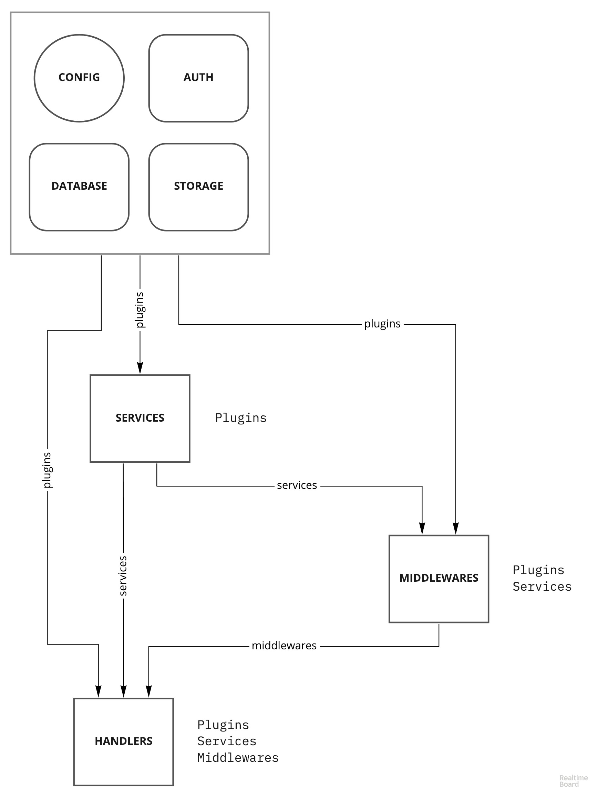

### Architecture

Auth, database and storage functionality are delegated to plugins.

- Auth - `@emeralt/auth-*`
- Database - `@emeralt/database-*`
- Storage - `@emeralt/storage-*`

Server is split into the 4 parts:

- `utils` are shared utils used in other parts
- `services` are dedicated to interation with external resources
- `middlewares` are plain express.js middlewares
- `handlers` are plain express.js handlers

---

